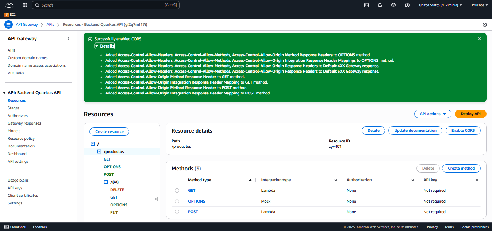
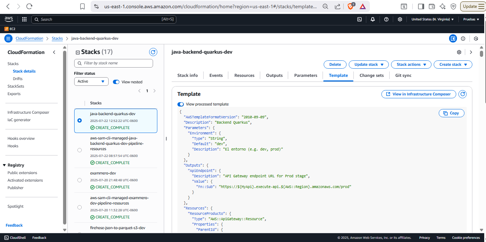
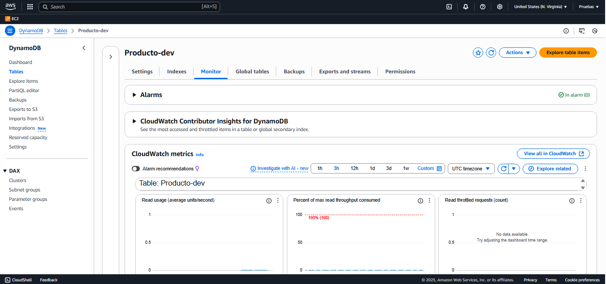
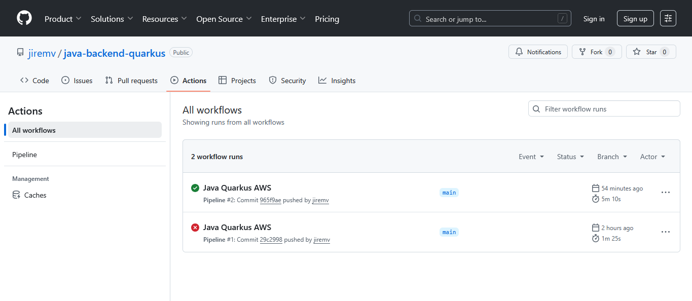

# 🔥  java-backend-quarkus

Application Java with Quarkus 100% Serverless

## 📄 Descripción

Este proyecto implementa una solución **serverless**. Esta solución no utiliza servidores EC2, tampoco contenedores Kuberrnetes. 
Es totalemente administrado por AWS el cual provee elasticidad, escalabilidad y alta disponibilidad.
Este es un proyecto backend java, que puedes utilizar con tus proyectos de frontend.

Utilizamos **Amazon API Gateway** que se comunica muy bien con  **AWS CloudFormation**. Vemos que ha creado el API

También tenemos la base de datos 100% serverless **Amazon DynamoDB**
Para arquitecturas en AWS Lambda o contenedores, Quarkus Reactivo destaca por memoria, arranque y enfoque cloud-native.
---

## 🏗️ Arquitectura

```plaintext
 [Java (Quarkus)]
        │
        ▼
  Framework compatible con:
     - Programación Imperativa
     - Programación Reactiva (opcional: Mutiny, RESTEasy Reactive)
        │
        ▼
 Compilas el Backend como:
   Lambda Handler (RequestHandler)
        │
        ▼
 Lambda ejecuta el método handleRequest()
  (100% serverless, paga por ejecución)
        │
        ▼
 Se ejecutan los métodos de backend

```
| **Criterio**                 | **Quarkus Reactivo**                                                                              | **Spring WebFlux (Spring Reactivo)**                                        |
| ---------------------------- | ------------------------------------------------------------------------------------------------- | --------------------------------------------------------------------------- |
| **Consumo de memoria**       | 🔥 Muy bajo. Optimizado para contenedores y serverless. Reducción agresiva del footprint.         | ⚠️ Medio. Aunque optimizado, requiere más memoria por el contexto Spring.   |
| **Arranque (cold start)**    | ⚡ Muy rápido. Ideal para Lambda y entornos serverless donde el tiempo de arranque impacta costos. | 🕒 Más lento. El contexto de Spring Boot es más pesado en tiempo de inicio. |
| **Ecosistema en AWS Lambda** | ✅ Excelente. Soporte nativo. Imágenes optimizadas. Buen rendimiento serverless.                   | ⚠️ Bueno. Compatible, pero menos eficiente en Lambda (cold starts mayores). |
| **Orientación**              | 🎯 Microservicios ligeros, serverless, arquitecturas cloud-native.                                | 🎯 Microservicios clásicos. No orientado directamente a serverless.         |


---

## 🛠️ Servicios AWS utilizados

- **Amazon API Gateway**
  - Permite controlar CORS .
  - Permite HTTP RESTful.
  - Proporciona el API para cliente frontend.
    

- **AWS CloudFormation**
  - Proporciona IaC.
  - Crea el Stack en los ambientes Dev y Prod.
    

- **Amazon DynamoDB**
  - Base de Datos 100% serverless.
  - Es no relacional.
    

- **AWS SAM (Serverless Application Model)**
  - Despliegue de la infraestructura como código (`template.yaml`).

---

## 🚀 Despliegue del proyecto

### 1️⃣ GitHub Actions
- Diríjase al link Actions, allí podrá visualizar el despliegue DevOps.
  

### 2️⃣ Clona el repositorio y navega al proyecto:
```bash
git clone https://github.com/tu-usuario/java-backend-quarkus.git
cd java-backend-quarkus
```

### 3️⃣ Despliegue:
```bash
sam build
sam deploy --guided
```

Durante el despliegue:
- Proporciona el nombre del stack.
- Define la región AWS.
- Acepta permisos de tipo `CAPABILITY_IAM`.

---

## 📊 Colección para probar con Postman


---

## 📈 Beneficios del proyecto

- ✅ Completamente **serverless**.
- ✅ Alta disponibilidad, funciona 24x7x365 sin caídas.
- ✅ Totalmente elática, si se conectan muchos usuarios, soporta la concurrencia sin límite.
- ✅ Arquitectura automatizada, simple y escalable. Para integrar más recursos y servicios.
- ✅ Costo controlado muy bajo 1$ al mes, sin servidores ni procesamiento batch complejo.

---

## 📋 Consideraciones adicionales

- Este proyecto AWS puede ser montado para su empresa.
- El `template.yaml` crea automáticamente:
  - El cloudformation.
  - La base de datos.
  - El AWS api gateway.

- El proyecto es ideal para ahorrar costos y obtener alta rentabilidad.

---


## 📜 Licencia

Este proyecto es de código abierto. Puedes adaptarlo y reutilizarlo bajo los términos de tu organización.

---

## 🧑 Contacto

**Paul Rivera**
AWS Certified Solutions Architect - Associate
Java Developer